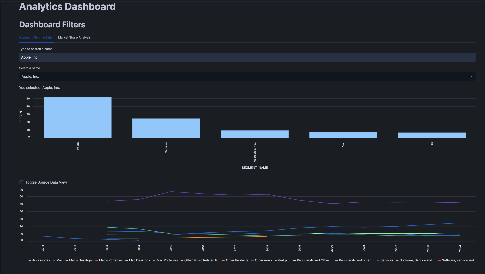
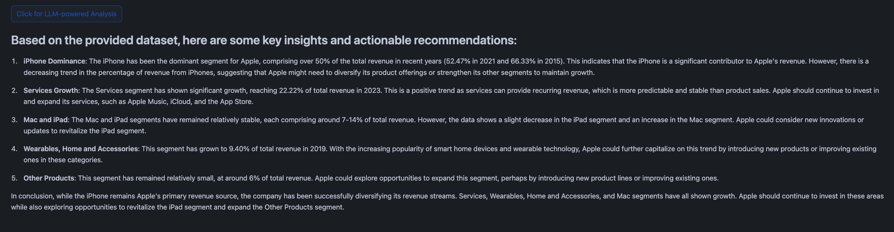
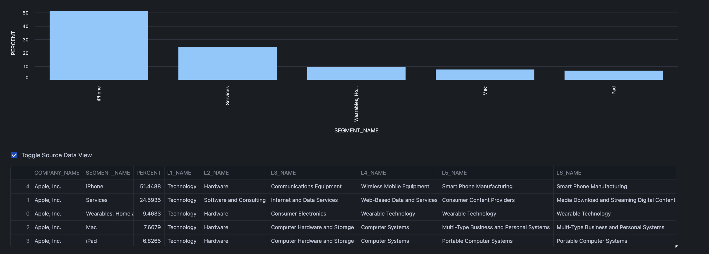
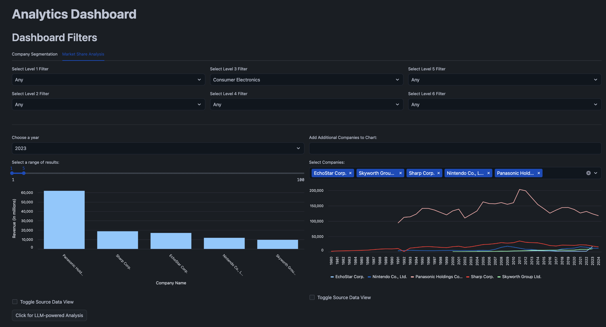

author: Aayush Turakhia
id: corporate-taxonomy-insights
summary: <This is a sample Snowflake Guide>
categories: Getting-Started,data-science-&-ml, solution-examples
environments: web
status: Published
feedback link: https://github.com/Snowflake-Labs/sfguides/issues
tags: Getting Started, Cortex, Data Science & Ai


# Corporate Taxonomy Insights
<!-- ------------------------ -->
## Overview
Duration: 5 minutes


Asset managers, corporate strategists, and consulting firms need an intuitive and precise way to classify and analyze market segments, enabling them to identify niche investment opportunities, benchmark competitors accurately, and generate highly customized, data-driven reports. Currently, these users struggle to find a unified solution that offers both broad industry overviews and deep, nuanced sub-segmentation. This lack of granularity and flexibility in current solutions limits their ability to make informed decisions, rapidly respond to market changes, and deliver tailored insights to their stakeholders. How might we design a comprehensive, user-friendly classification tool that provides accurate segmentation, competitive benchmarking, and customizable analytics to empower strategic decision-making across diverse industries?


Factset's RBICS (Revere Business Industry Classifications System) datafeed contains a comprehensive structured taxonomy offering precise classifications for global companies, based on their operating footprint. The taxonomy has a 14 by six matrix structure, with 12 anchor industries and two specialty industries with each industry supporting five additional layers of depth. For levels four through six, a patented, bottom-up approach of classifying companies according to the products and services they offer results in an unparalleled level of precision and granularity. The top levels’ market-defined approach ensures companies are grouped based on behavioral similarities and stock co-movement. We can leverage this datafeed alongside Snowflake's platform to generate a tool that can solve the problem we currently face.


In 2024, FactSet introduced the Cortex Analyst platform, integrating advanced AI capabilities with its powerful data management system to empower asset managers, corporate strategists, and consulting firms. By utilizing Cortex AI LLM (Large Language Model) functions, the platform enhances the precision and flexibility of market segment classification and analysis. Cortex Analyst allows users to seamlessly navigate through FactSet’s comprehensive RBICS taxonomy, offering a unified tool that not only provides broad industry overviews but also delivers deep, granular insights into niche sub-segments. This is particularly crucial for users who face challenges in identifying unique investment opportunities, benchmarking competitors, and generating customized, data-driven reports.


Snowflake’s robust data-sharing capabilities, elastic compute power and zero-copy data sharing functionality make it ideal for quickly analyzing vast amounts of complex data, providing high levels of segmentation accuracy, and delivering insights that are both broad in scope and deep in detail. Snowflake’s ability to handle large datasets with ease ensures that users can efficiently process and analyze data from diverse sources, ensuring that strategic decisions are based on accurate, up-to-date information. For asset managers and strategists, this combination of Snowflake’s cloud infrastructure with FactSet's precise classifications means faster, more informed decision-making, ultimately allowing firms to stay ahead of market changes and deliver personalized insights to stakeholders.


### Prerequisites
- A non-trial Snowflake account with access to a role that has the ACCOUNTADMIN role. If not, you will need to work with your admin to perform the initial environment setup.
- Git installed.


### What You’ll Learn
- How to perform advanced analytics with RBICS's centralized data, Snowflake's dashboarding capabilities, and [Cortex LLM functions](https://docs.snowflake.com/en/user-guide/snowflake-cortex/llm-functions) to understand trends and patterns
- How to leverage [Cortex Analyst](https://docs.snowflake.com/en/user-guide/snowflake-cortex/cortex-analyst) and AI to ask questions in Natural language against the data
- How to create an unified platform in [Streamlit](https://docs.snowflake.com/en/developer-guide/streamlit/about-streamlit) to perform stategic analyses of companies at varying levels of granularity


### What You’ll Need
- A [Snowflake](https://signup.snowflake.com/?utm_cta=quickstarts_) account in a region where Snowflake Cortex is available.
- Access to the ACCOUNTADMIN role. If not, you will need to work with your admin to perform the initial environment setup.
- Git installed.


### What You’ll Build
- A **Cross-Cloud Data Integration Platform** that integrates FactSet’s RBICS taxonomy with Snowflake’s cloud infrastructure, unifying market and industry data across AWS, GCP, and Azure for seamless access and analysis.
- An **Advanced Analytics Pipeline** that leverages elastic compute and zero-copy data sharing to uncover insights from large-scale market data, helping users identify investment opportunities, benchmark competitors, and refine market segmentation.
- A **Natural Language Querying Interface** powered by Cortex AI enabling users to easily interact with data and generate customized, actionable insights through simple, conversational queries.


<!-- ------------------------ -->
## Setup Environment
Duration: 2

To get started using Snowflake Notebooks, first login to Snowsight. In the top-left corner, click "+ Create" to create a new Worksheet, and choose "SQL Worksheet".


**Step 1**. - Paste and run the following [setup.sql](https://github.com/snowflakedb/sfguide-corporate-taxonomy-insights/blob/main/scripts/setup.sql) in the SQL worksheet to create Snowflake objects (warehouse, database, schema).

```sql
USE ROLE SYSADMIN;

CREATE OR REPLACE WAREHOUSE CORPORATETAXONOMYINSIGHTS_WH; --by default, this creates an XS Standard Warehouse
CREATE OR REPLACE CORPORATETAXONOMYINSIGHTS_DB;
CREATE OR REPLACE SCHEMA PUBLIC;

USE WAREHOUSE CORPORATETAXONOMYINSIGHTS_WH;
USE DATABASE CORPORATETAXONOMYINSIGHTS_DB;
USE SCHEMA PUBLIC;

CREATE STAGE IF NOT EXISTS semantic_model_stage DIRECTORY = (ENABLE = TRUE) ENCRYPTION = (TYPE = 'SNOWFLAKE_SSE'); --to store semantic model assets

GRANT OWNERSHIP ON STAGE semantic_model_stage TO ROLE public COPY CURRENT GRANTS;

CREATE STAGE IF NOT EXISTS streamlit DIRECTORY = (ENABLE = TRUE) ENCRYPTION = (TYPE = 'SNOWFLAKE_SSE'); --to store streamlit assets

GRANT OWNERSHIP ON STAGE streamlit TO ROLE public COPY CURRENT GRANTS;
```

Once this is complete, make sure the [semantic model file](https://github.com/snowflakedb/sfguide-corporate-taxonomy-insights/tree/main/models) is uploaded to the SEMANTIC_MODEL_STAGE stage within the 'PUBLIC' schema, and that both [Streamlit files](https://github.com/snowflakedb/sfguide-corporate-taxonomy-insights/tree/main/scripts/streamlit) are uploaded to the STREAMLIT stage as well. To see stages, navigate to the Databases tab and find {Database Name} > Public > Stages.

**Step 2**. - Now run the following excerpt from the same [setup.sql](https://github.com/snowflakedb/sfguide-corporate-taxonomy-insights/blob/main/scripts/setup.sql) file to set up the streamlit application.

```sql
CREATE OR REPLACE STREAMLIT corporate_taxonomy_insights_streamlit
ROOT_LOCATION = '@STREAMLIT'
MAIN_FILE = 'app.py'
QUERY_WAREHOUSE = 'CORPORATETAXONOMYINSIGHTS_WH'
COMMENT = '{"origin":"sf_sit", "name":"cti_ds", "version":{"major":1, "minor":0}, "attributes":{"is_quickstart":0, "source":"streamlit"}}';

```

Finally, to complete the setup, run the [build_view.sql](https://github.com/snowflakedb/sfguide-corporate-taxonomy-insights/blob/main/scripts/build_view.sql) file to create the view that the chatbot operates on.


<!-- ------------------------ -->
## Streamlit App
Duration: 2


The Streamlit app has now been deployed. To access it, select the 'SYSADMIN' role in the bottom left corner of the Snowsight page, and then under Projects, click on the Corporate Taxonomy Insights application.


```markdown
## Segmentation Dashboarding
Duration: 3


Select the **Analytics** tab to view the dashboarding section of the solution. Here we begin on the **Company Segmentation** tab. From here, you can perform internal analyses on any company within the available RBICS dictionary. For this example, try entering in "Apple, Inc" and then selecting that option from the subsequent dropdown. Upon doing so, you will see a set of dashboards appear, representing the current breakdown of the company by business segment, and how that information has changed historically..



From these dashboards, you can immediately begin deriving insights. However, to automate the analysis process, you can leverage Snowflake Cortex's LLM functions to auto-generate an analysis of the data currently being viewed. Press the **Click for LLM-powered Analysis** button at the bottom of the screen to generate this automated report.



Now, let's take a dive into an analysis of a specific industry. Hit the checkbox underneath the first graph to view its source data:



Here, we can view the different organizational units that each segments falls into at every level of the RBICS hierarchy. We can then decide to select any one of these to analyze further. For this example, let's say we choose the **Consumer Electronics** level 3 filter that Apple's Wearable Technology segment falls under.

## Market Share Dashboarding
Duration: 1

Moving on to the Market Share Analysis section of the dashboarding tab, you will see we have the ability to filter based on a specific industry at any level of the RBICS hierarchy. As we had decided to select the Consumer Electronics level 3 filter for this example, we can filter down to there here:



Now we have the ability to view not only the top companies in that specific space at any year individually, but all this data historically as well. Experiment with changing the year on the left pane as well as with adding new companies to the right pane. Try entering "Amazon.com, Inc" into the new companies text box, and then you should be able to add Amazon to the graph in the box dropdown to add their sales information to the graph. Try removing them and see the graph dynamically adjust to that as well.

The same capability to generate an LLM-powered analysis exists for this tab as well, and you can use it to generate a similar analysis to that of the segmentation tab, but for the data o your screen.

## Data Retrieval Chatbot

The dashboard capability is useful in displaying basic information regarding corporation diversity and industry market share, but any more niche or specific questions that a user might have would require another tool. The Data Retrieval Chatbot serves exactly this purpose.


Here we have the homepage - a few sample questions are populated for us to get started, so let's go ahead and select one to familiarize ourselves with the chatbot.


Users are given the option to view both the raw data returned and the query used to retrieve it through two expanders that are generated with each response. Chat history is also passed with each question, so users can follow up on previously executed queries.

While useful and difficult to retrieve through the dashboard, the question included above does not provide any truly unique insight. To truly showcase the chatbot’s ability, we can ask it to perform more complex analysis such as the one below:


Here it is asked to retrieve companies with the highest growth rate in a particular industry. Information such as this can be incredibly valuable in identifying potential fast-growing disruptors in an industry, and would otherwise be difficult to aggregate. Questions such as these showcase the true value and capabilities of the solution.

In addition to retrieving this data, users are able to generate custom visualizations as well if the chart checkbox is ticked at the top. Below we can see the previous query’s results visualized in a simple bar graph:


Enter your own queries! Ask questions about the hierarchy, company sales, growth etc. The chatbot is capable of answering such questions, and is equipped with historical data as well.


<!-- ------------------------ -->
## Conclusion And Resources
Duration: 1

In this quickstart guide, you learned how we can leverage Snowflake's Cortex Suite and Data Engineering capabilties to build a centralized tool that can perform a wide range of data analysis and aggregation tasks with ease. 

### Additional Resources
- [Medium Blog](https://medium.com/snowflake/corporate-taxonomy-insights-building-a-comprehensive-ai-assisted-analysis-tool-33709b51d35c)
- [Youtube Video](https://www.youtube.com/watch?v=rebNFMYAfu4)


### What You Learned
- creating steps and setting duration
- adding code snippets
- embedding images, videos, and surveys
- importing other markdown files


### Related Resources
-
- #### [Snowpark Cortex LLM](https://docs.snowflake.com/en/user-guide/snowflake-cortex/llm-functions)


